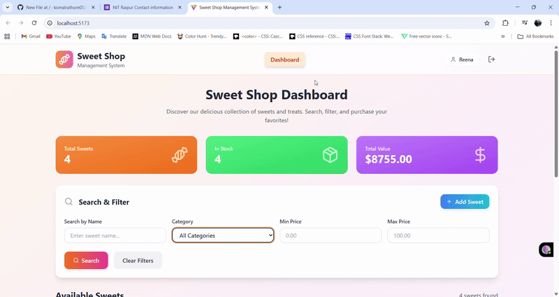
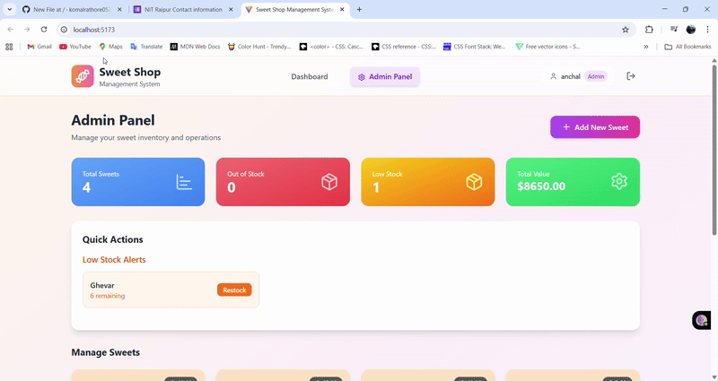

# 🍭 Sweet Shop Management System

<div align="center">
  <a href="https://precious-empanada-43b18c.netlify.app/" target="_blank">
    
  </a>
</div>

<br>

## 📖 Project Overview
The **Sweet Shop Management System** is a full-stack web application designed to streamline the operations of a sweet shop. The application provides two primary interfaces: a public-facing storefront for customers to browse and purchase products, and a secure admin panel for shop owners to manage inventory in real-time.

---

## ✨ Key Features

* **🛒 Customer Dashboard:** A clean, intuitive interface where customers can view all available sweets, see their details, and "purchase" them.
* **🔐 Admin Panel:** A dedicated and secure dashboard for administrators to monitor key metrics such as total sweets, low-stock items, and total inventory value.
* **📦 Inventory Management:** Admins can easily add new sweets, edit existing ones, restock low-quantity items, and delete products from the inventory.
* **🔗 RESTful API:** The frontend communicates with a separate, robust backend API to handle all data operations, ensuring a clean separation of concerns.

---

## 🛠️ Technologies Used
This project is built using a modern and scalable tech stack.

### Frontend


### Backend


---

## 🚀 Local Development Setup
To get the project running locally, follow these steps. You will need to set up both the frontend and backend separately.

### ✅ Prerequisites
* **Java Development Kit (JDK):** Version 17 or higher.
* **Build Tool:** Maven or Gradle.
* **Database:** A running instance of PostgreSQL.
* **Node.js & npm/yarn:** For the frontend.

### ⚙️ Installation & Setup

#### 1. Clone the Repository
First, clone the project to your local machine:
```bash
git clone [https://github.com/komalrathore0521/Sweet_Shop_Management_System.git](https://github.com/komalrathore0521/Sweet_Shop_Management_System.git)
cd Sweet_Shop_Management_System
```
### ⚙️ Installation & Setup

1.  **Clone the repository:**

    ```bash
    git clone [https://github.com/komalrathore0521/Sweet_Shop_Management_System.git](https://github.com/komalrathore0521/Sweet_Shop_Management_System.git)
    cd Sweet_Shop_Management_System
    ```

2.  **Set up the Backend (Spring Boot):**

    * Navigate to the backend directory:

        ```bash
        cd backend/
        ```

    * **Database Configuration:**
        You will need to create a database named `sweet_shop_db` in your local PostgreSQL instance. Then, open the `src/main/resources/application.properties` file and update the connection details with your credentials.

        ```properties
        # PostgreSQL Database Configuration
        spring.datasource.url=jdbc:postgresql://localhost:5432/sweet_shop_db
        spring.datasource.username=your_db_user
        spring.datasource.password=your_db_password
        spring.jpa.hibernate.ddl-auto=update
        spring.jpa.show-sql=true
        ```

    * Build and run the application:

        * **If using Maven:**
            ```bash
            ./mvnw spring-boot:run
            ```
        * **If using Gradle:**
            ```bash
            ./gradlew bootRun
            ```

    The backend server will start on `http://localhost:8081`.

3.  **Set up the Frontend (React):**

    * Open a new terminal and navigate to the frontend directory:

        ```bash
        cd frontend/
        ```

    * Install the dependencies:

        ```bash
        npm install
        ```

    * **Configure Environment Variables:**
        Create a `.env` file in the `frontend/` directory and add the following line to connect the frontend to your local backend API.

        ```env
        VITE_REACT_APP_API_URL=http://localhost:8081/api
        ```

    * Start the React development server:

        ```bash
        npm start
        ```

    The frontend will be available at `http://localhost:5173`.


## 📸 Screenshots

### Customer Dashboard
<p align="center">
  
</p>

### Admin Panel
<p align="center">
  
</p>


## 🧪 Test Report
This report summarizes the execution results of the automated test suite for the Sweet Shop Management System.

### 💻 Backend API Tests (JUnit 5)
Focuses on the integrity and security of the RESTful API endpoints.

| Test Area                      | Description                                                                                                                              | Status |
| ------------------------------ | ---------------------------------------------------------------------------------------------------------------------------------------- | :----: |
| **Authentication/Authorization** | Login/Logout flow, JWT validation, and Spring Security access restriction for Admin-only routes.                                       |   ✅   |
| **Inventory CRUD Operations** | Creation, retrieval, updating, and deletion of products. Validation of input data (e.g., non-negative price/quantity).                  |   ✅   |
| **Public Retrieval** | Ensures public users can retrieve the sweet list and that sensitive Admin-only data is not exposed.                                      |   ✅   |
| **Transaction Logic** | Verifies that purchasing a sweet decreases its quantity and correctly handles exceptions for out-of-stock items.                         |   ✅   |

### ⚛️ Frontend UI Tests (React Testing Library)
Ensures React components render and function correctly.

| Component         | Functionality Tested                                                                                                                 | Status |
| ----------------- | ------------------------------------------------------------------------------------------------------------------------------------ | :----: |
| **Sweet Card** | Correct display of data. Disabling of 'Purchase' button when quantity is 0. Conditional rendering of Admin buttons.                |   ✅   |
| **Admin Panel** | Calculation of key metrics. Conditional rendering of Low Stock Alerts. Successful display of loading state (skeleton).             |   ✅   |
| **Sweet Form Modal** | Successful form submission for 'Add' and 'Edit' modes. Validation for required fields. Correct handling of the `onClose` action.    |   ✅   |
| **Dashboard** | Correctly filters/searches products. Proper display of `SweetCard` components.                                                       |   ✅   |


## 🤖 My AI Usage
This project's code and documentation were developed with the assistance of an AI large language model. The model served as a collaborative partner for various tasks, including:

* **Code Generation:** Generating initial drafts of React components and API service functions.
* **Code Refactoring:** Reviewing and suggesting improvements to existing code for better readability, performance, and best practices.
* **Debugging:** Identifying and resolving specific issues, such as the missing close button on the `SweetFormModal` component.
* **Documentation:** Drafting this comprehensive `README.md` file, including project explanations and setup instructions.

The use of AI has significantly enhanced the development workflow. All generated content was reviewed and validated to ensure it meets the project's requirements and quality standards.
