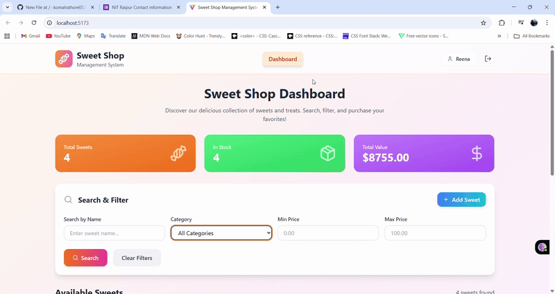
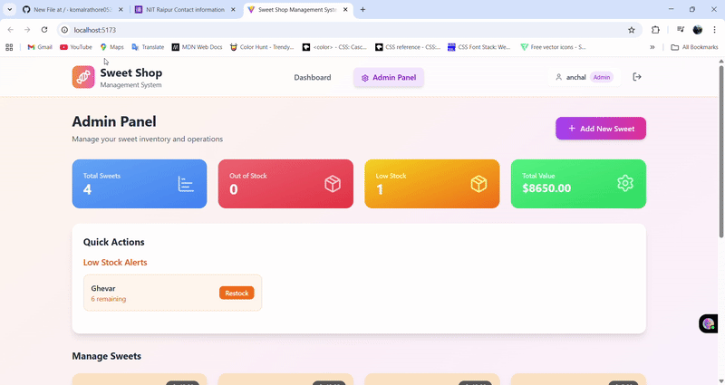

## Sweet Shop Management System
### Project Overview
The Sweet Shop Management System is a full-stack web application designed to streamline the operations of a sweet shop. The application provides two primary interfaces: a public-facing storefront for customers to browse and purchase products, and a secure admin panel for shop owners to manage inventory in real-time.

#### Key Features:

**Customer Dashboard:** A clean, intuitive interface where customers can view all available sweets, see their details, and "purchase" them.

**Admin Panel:** A dedicated and secure dashboard for administrators to monitor key metrics such as total sweets, low-stock items, and total inventory value.

**Inventory Management:** Admins can easily add new sweets, edit existing ones, restock low-quantity items, and delete products from the inventory.

**RESTful API:** The frontend communicates with a separate, robust backend API to handle all data operations, ensuring a clean separation of concerns.

#### Technologies Used
The project is built using a modern and scalable tech stack.

### Frontend:

**React:** A JavaScript library for building user interfaces.

**TypeScript:** A strongly typed language that builds on JavaScript, providing enhanced code quality and developer tools.

**Tailwind CSS:** A utility-first CSS framework for rapidly building custom designs.

**Lucide React:** A set of beautiful and consistent open-source icons.

### Backend:
**Spring Boot:**  A powerful backend runtime and web framework for building the REST API.

**Database:** PostgreSQL

#### Local Development Setup
To get the project up and running on your local machine, follow these steps. This project has a separate frontend and backend, so you will need to set up both.

**Prerequisites**
* Make sure you have the following installed on your machine:

java-17 or higher

* Step 1: Clone the Repository
  * First, clone the project repository to your local machine:

  * git clone [https://github.com/komalrathore0521/Sweet_Shop_Management_System.git](https://github.com/komalrathore0521/Sweet_Shop_Management_System.git)
  * cd Sweet_Shop_Management_System

* Step 2: Backend Setup
  * Navigate to the backend directory (you may need to create this directory if it doesn't exist and move your backend code there).

 * cd backend/

* Install the backend dependencies(needed):

**Configure your environment variables. Create a .env file in the backend/ directory with the following content (adjust values as needed):**

PORT=8081
# Add your database connection string and any other secrets here

**Start the backend server:**

The backend should now be running and listening for requests on http://localhost:8081.

* Step 3: Frontend Setup
Open a new terminal and navigate to the frontend directory (e.g., the project root or frontend/).

cd ..
# or
cd frontend/

**Install the frontend dependencies:**

npm install
# or
yarn install

Configure the API URL for the frontend. Create a .env file in the frontend/ directory with the following line:

VITE_REACT_APP_API_URL=http://localhost:8081/api

**Start the frontend development server:**

npm start

The application will now be running on http://localhost:5173 or a similar port.

Screenshots
Below are screenshots of the final application.

### Customer Dashboard

### Admin Panel

### My AI Usage
This project's code and documentation were developed with the assistance of an AI large language model. The model served as a collaborative partner for various tasks, including:

Code Generation: Generating initial drafts of React components and API service functions based on high-level descriptions.

Code Refactoring: Reviewing and suggesting improvements to existing code for better readability, performance, and adherence to best practices.

Debugging: Identifying and resolving specific issues, such as the missing close button on the SweetFormModal component.

Documentation: Drafting this comprehensive README.md file, including project explanations, setup instructions, and this statement itself.

The use of AI has significantly enhanced the development workflow by providing a powerful tool for accelerating repetitive tasks and offering solutions to common programming challenges. All generated content was reviewed and validated to ensure it meets the project's requirements and quality standards.
